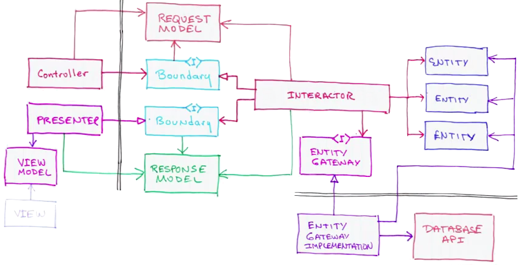

# smilecar-api

This API is responsible for providing offer information sorted by rating average. 

## Development

### Run standalone

> Install the dependencies first: `yarn install`

1. Run `yarn start`
2. Happy coding 🚀

### Tests

- Unit tests: run `yarn test`

### Technology

####  important packages

|   Package name     | Description |
| :-----------: | :--------------------------------------------------------------------------------------------------------------------------------- |
|  [expressjs](https://github.com/expressjs/express) | Used as server framework |
|  [inversify](https://github.com/inversify/InversifyJS)  | A lightweight and easy to use inversion of control container |
|  [pino](https://github.com/pinojs/pino)  | A low overhead logging framework |

#### Architecture

The "Clean Architecture" pattern by Uncle Bob intrigued me for quite some time. Therefore, I thought it would be a good opportunity to test this pattern in your coding challenge.
I had to make some changes throughout the data flow to implement this pattern into JavaScript. Still, I think it is possible to use this pattern in the future. Yay!

[Uncle Bob - the-clean-architecture](https://blog.cleancoder.com/uncle-bob/2012/08/13/the-clean-architecture.html)

[Source](https://stackoverflow.com/questions/29867671/clojure-architecture-like-uncle-bob-did)

    .
    ├── ...
    ├── src
    │   ├── controller              # All controllers for each route (handles all requests)
    │   ├── DI                      # Inversify Dependency Injection
    │   ├── domain                  # All buisines specific functions (Interactors, Interfaces)
    │   ├── infrastructure          # All serverframework (express) specific files and flows
    │   │   ├── routes              # Route definitions
    │   │   └── server              # Express server files
    │   └── services                # Services that load the required data and convert them to a specific structure (Interface in domain)
    └── ...
